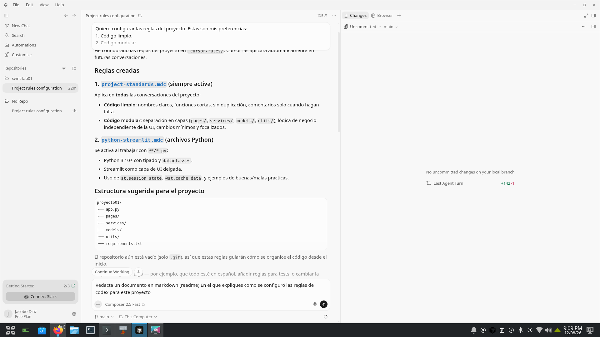
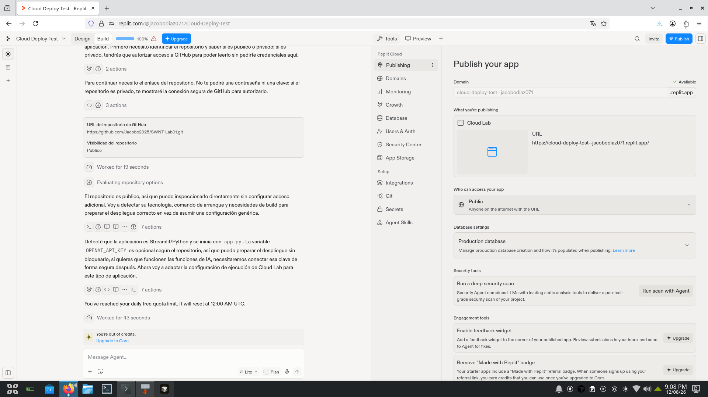
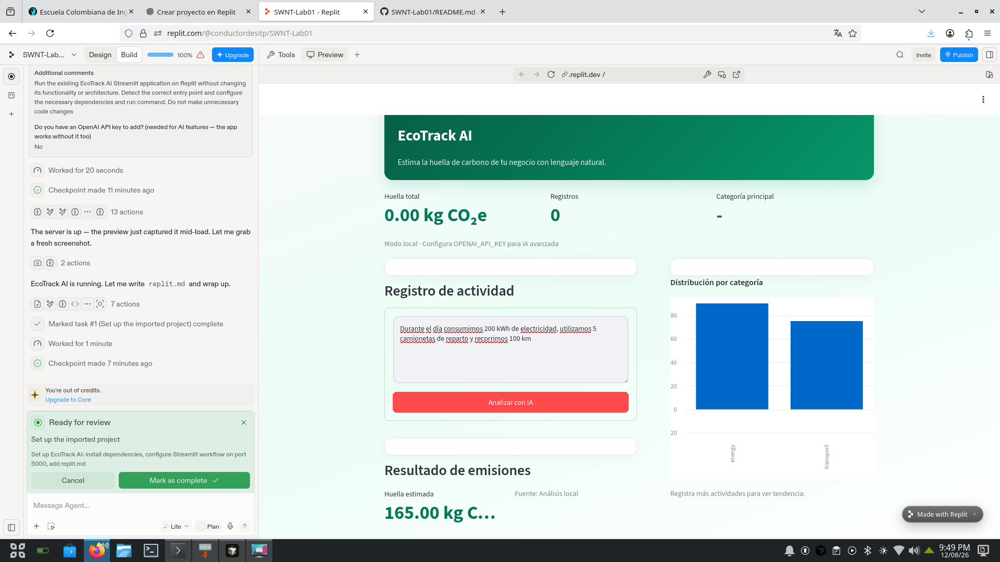

# Experiencia de Vibe Coding

## EcoTrack AI

EcoTrack AI es un **Producto Mínimo Viable (MVP)** desarrollado para estimar de forma simplificada la huella de carbono de un negocio mediante descripciones realizadas en lenguaje natural.

El objetivo del proyecto es demostrar cómo el **Vibe Coding** permite transformar una idea en una aplicación funcional utilizando agentes de inteligencia artificial para generar, configurar, probar y refinar el software mediante instrucciones en lenguaje natural.

---

## Herramientas utilizadas

- **Cursor:** generación y modificación del código mediante prompts.
- **Replit:** importación, configuración y ejecución del proyecto en la nube.
- **Git y GitHub:** control de versiones y almacenamiento del código.
- **Python:** lenguaje utilizado para la aplicación.
- **Streamlit:** framework utilizado para construir la interfaz web.

---

# 1. Ejecución Técnica y Vibe Coding

## Definición del proyecto

El problema planteado fue desarrollar una aplicación que permitiera a pequeños negocios estimar su huella de carbono sin tener que completar formularios complejos.

La idea principal consiste en que el usuario pueda describir sus actividades utilizando lenguaje natural.

Por ejemplo:

> "Durante el día consumimos 200 kWh de electricidad, utilizamos 5 camionetas de reparto y recorrimos 100 km."

La aplicación debe interpretar esta información, identificar las actividades relevantes y generar una estimación de emisiones expresada en **kg de CO₂ equivalente**.

---

## Configuración de reglas para el agente

Antes de comenzar el desarrollo configuré las reglas del proyecto en Cursor.

Utilicé el siguiente prompt:

```text
Quiero configurar las reglas del proyecto. Estas son mis preferencias:

1. Código limpio.
2. Código modular.
3. Uso de frameworks modernos como Python/Streamlit.
```

Posteriormente, Cursor creó automáticamente la carpeta:

```text
.cursor/rules
```

y añadió allí las reglas que debía seguir el agente durante el desarrollo.

Esto permitió establecer unas condiciones iniciales para que el código generado mantuviera una estructura consistente.

---

## Master Prompt

Posteriormente utilicé un **Master Prompt** para proporcionar al agente todo el contexto necesario para desarrollar EcoTrack AI.

El prompt describía:

- El objetivo del producto.
- El problema que debía solucionar.
- El flujo principal de la aplicación.
- La interfaz de entrada de lenguaje natural.
- La identificación de actividades.
- Las categorías de emisiones.
- El cálculo de CO₂e.
- El dashboard.
- Los gráficos.
- Las recomendaciones.
- La arquitectura.
- Requisitos básicos de seguridad.
- El diseño visual.

Una de las partes principales del prompt establecía que la aplicación debía transformar una descripción como:

```text
"Durante el día consumimos 200 kWh de electricidad y usamos 5 camionetas."
```

en información estructurada similar a:

```text
{
    "activities": [
        {
            "category": "energy",
            "type": "electricity",
            "quantity": 200,
            "unit": "kWh"
        },
        {
            "category": "transport",
            "type": "delivery_van",
            "quantity": 5,
            "unit": "vehicles"
        }
    ]
}
```

El objetivo de proporcionar este nivel de detalle fue reducir la ambigüedad y permitir que el agente comprendiera tanto la funcionalidad como la intención del producto.

---

## Resultado técnico

Como resultado del proceso de Vibe Coding se obtuvo una aplicación funcional desarrollada con **Python y Streamlit**.

El MVP incluye:

- Dashboard de huella de carbono.
- Registro de actividades mediante lenguaje natural.
- Análisis de las actividades introducidas.
- Clasificación por categorías.
- Cálculo de emisiones.
- Resultado en kg CO₂e.
- Distribución de emisiones por categoría.
- Interfaz visual relacionada con sostenibilidad.
- Ejecución local y en Replit.

---

# 2. Integración de funcionalidades de IA

Una de las funcionalidades principales del MVP consiste en utilizar lenguaje natural como mecanismo de entrada.

En lugar de obligar al usuario a completar un formulario con múltiples campos, puede escribir directamente una descripción de sus actividades.

Por ejemplo:

```text
Durante el día consumimos 200 kWh de electricidad,
utilizamos 5 camionetas de reparto y recorrimos 100 km.
```

El sistema analiza la descripción y obtiene información relacionada con:

- Categoría.
- Tipo de actividad.
- Cantidad.
- Unidad.

Posteriormente estos datos se utilizan para realizar el cálculo de emisiones.

## Procesamiento de múltiples actividades

Durante las pruebas se verificó que una misma entrada pudiera contener más de una categoría.

Por ejemplo, al introducir:

```text
Durante el día consumimos 200 kWh de electricidad,
utilizamos 5 camionetas de reparto y recorrimos 100 km.
```

el sistema identificó categorías como:

```text
energy
transport
```

y las representó en el gráfico de distribución del dashboard.

---

## IA avanzada

La aplicación también fue preparada para utilizar una API de inteligencia artificial mediante la variable de entorno:

```text
OPENAI_API_KEY
```

Sin embargo, durante esta experiencia no se configuró una clave de API de OpenAI. Por esta razón, las pruebas realizadas corresponden al **modo local de análisis** implementado en el MVP.

Esta decisión permitió mantener la aplicación funcional sin depender de una API externa.

---

# 3. Desarrollo iterativo y debugging

Una parte importante del proceso consistió en probar la aplicación después de que el agente generara la primera versión.

Durante las pruebas encontré un problema en el reconocimiento de actividades relacionadas con el consumo de cigarrillos.

La aplicación inicialmente no detectaba correctamente que esta actividad podía representar una fuente de emisiones.

Este problema fue utilizado como punto de partida para realizar una nueva instrucción al agente y solicitar una corrección.

También se realizaron pruebas con entradas que contenían múltiples actividades y categorías para verificar que el sistema no se limitara a procesar una sola actividad.

Este proceso permitió comprobar que el desarrollo mediante Vibe Coding no consiste únicamente en generar código una vez, sino en:

```text
Prompt
   ↓
Código generado
   ↓
Prueba
   ↓
Problema encontrado
   ↓
Nuevo prompt
   ↓
Corrección
   ↓
Nueva prueba
```

---

# 4. Configuración y pruebas en Replit

Después de desarrollar la primera versión en Cursor, el proyecto fue almacenado en GitHub e importado posteriormente en Replit.

Replit detectó el proyecto como una aplicación de **Python/Streamlit** y realizó la configuración necesaria para ejecutarlo.

El agente configuró:

- Dependencias.
- Entorno de ejecución.
- Workflow de Streamlit.
- Puerto de ejecución.
- Archivo `replit.md`.

La aplicación pudo ejecutarse correctamente dentro del entorno de Replit.

Durante una prueba se introdujo:

```text
Durante el día consumimos 200 kWh de electricidad,
utilizamos 5 camionetas de reparto y recorrimos 100 km.
```

El sistema generó un resultado de emisiones y mostró diferentes categorías en el gráfico.

---

# 5. Dificultades encontradas

## Límites de créditos

Una de las principales dificultades fue el límite de créditos de las herramientas de generación de código.

Durante el desarrollo, los créditos disponibles de Cursor se agotaron después de realizar varias interacciones. Una de las peticiones de modificación quedó sin terminar.

Posteriormente también se utilizó Replit para continuar con la configuración y ejecución del proyecto, pero los créditos disponibles del agente se agotaron rápidamente.

Esto mostró una de las limitaciones prácticas del Vibe Coding: el desarrollo depende parcialmente de los límites establecidos por las plataformas utilizadas.

---

## Despliegue

La aplicación pudo ejecutarse correctamente en Replit, pero al intentar realizar el despliegue público mediante Replit Cloud, la plataforma solicitó actualizar el plan utilizado.

Por esta razón, el proyecto quedó funcionando dentro del entorno de desarrollo de Replit, pero no se realizó un despliegue público desde esta plataforma.

El código fuente permanece disponible en GitHub.

---

# 6. Pensamiento crítico sobre el Vibe Coding

La experiencia permitió comprobar que el Vibe Coding puede acelerar considerablemente el desarrollo de software.

En lugar de escribir manualmente cada componente de la aplicación, pude describir mediante lenguaje natural qué quería construir y permitir que el agente generara gran parte de la implementación.

El resultado inicial de EcoTrack AI se obtuvo en pocos minutos a partir de un prompt detallado. Un proceso que normalmente requeriría diseñar la interfaz, estructurar el código, implementar la lógica y realizar múltiples configuraciones manualmente pudo convertirse rápidamente en un prototipo funcional.

Sin embargo, la experiencia también mostró que el Vibe Coding **no elimina la necesidad de conocimientos técnicos**.

Fue necesario:

- Entender el problema.
- Diseñar la funcionalidad.
- Escribir prompts precisos.
- Probar el resultado.
- Detectar errores.
- Evaluar si el comportamiento generado era correcto.
- Decidir qué debía modificarse.

Por lo tanto, considero que el papel del desarrollador cambia de simplemente escribir código a **dirigir, revisar, probar y validar el código generado por la inteligencia artificial**.

Personalmente todavía no me siento completamente cómodo utilizando este tipo de herramientas, pero considero que son una herramienta muy útil para acelerar el desarrollo y convertir ideas en prototipos funcionales.

Una de las principales conclusiones de esta experiencia es que la calidad del resultado depende en gran medida de la capacidad del desarrollador para **comunicar correctamente la intención del producto al agente**.

---

# 7. Relación con la rúbrica

| Criterio | Evidencia en el proyecto |
| :--- | :--- |
| **Ejecución Técnica y Vibe Coding** | Se utilizó Cursor para generar el MVP a partir de prompts, configurar reglas del proyecto, desarrollar la interfaz y generar la lógica inicial. Posteriormente se utilizó Replit para configurar y ejecutar la aplicación. |
| **Integración de Funcionalidades de IA** | El MVP permite introducir actividades mediante lenguaje natural, identificar categorías, cantidades y unidades y utilizar esta información para estimar emisiones. La aplicación también fue preparada para una integración con OpenAI mediante `OPENAI_API_KEY`. |
| **Pensamiento Crítico y Documentación** | Se documentaron los prompts utilizados, la configuración de reglas, las pruebas realizadas, los problemas encontrados, las limitaciones de créditos y las dificultades durante el despliegue. También se reflexionó sobre las ventajas y limitaciones del Vibe Coding. |

---

# 8. Conclusión

EcoTrack AI demuestra cómo una idea puede convertirse rápidamente en un MVP funcional utilizando herramientas de desarrollo impulsadas por inteligencia artificial.

El proceso permitió experimentar directamente con el ciclo de Vibe Coding:

```text
Idea
 ↓
Prompt
 ↓
Generación mediante IA
 ↓
Prueba
 ↓
Detección de problemas
 ↓
Refinamiento
 ↓
Aplicación funcional
```

Aunque el proyecto presenta limitaciones y algunas funcionalidades podrían seguir mejorándose, la experiencia permitió comprobar el potencial de los agentes de IA como herramientas para acelerar el desarrollo de software.

---

# Capturas de pantalla

## Configuración de reglas en Cursor



## Ejecución y configuración en Replit



## EcoTrack AI funcionando


